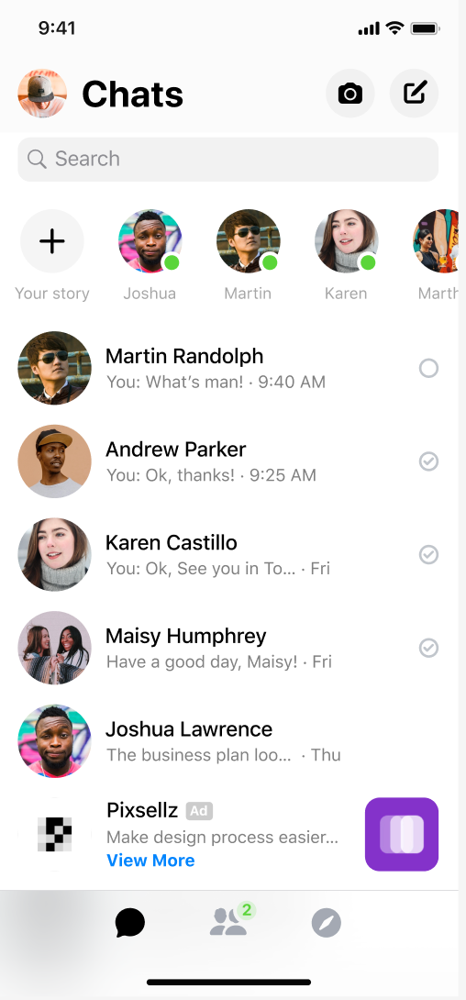

# SimpleChat - Kotlin Multiplatform Chat App

A modern chat application built with **Kotlin Multiplatform** and **Compose Multiplatform**, targeting Android and iOS platforms. This project demonstrates how to create a cross-platform chat interface with a clean, modern UI design.

## FigmaInput

https://www.figma.com/design/9FYcJ44Kr3AEBGDXhcIIaF/Simple_Chat_1?node-id=0-1



## 🚀 Features

- **Cross-platform compatibility**: Runs on both Android and iOS
- **Modern UI**: Built with Material 3 design system
- **Chat interface**: Displays chat conversations with avatars and timestamps
- **Stories section**: Instagram-style stories feature
- **Search functionality**: Search bar for finding conversations
- **Bottom navigation**: Tab-based navigation system
- **Mock data**: Includes sample chat data for demonstration

## 📱 Screenshots

The app features a chat list interface with:
- Status bar and top navigation
- Search functionality
- Stories section with user avatars
- Chat list with read/unread indicators
- Advertisement integration
- Bottom tab navigation

## 🛠 Tech Stack

- **Kotlin Multiplatform**: Cross-platform development
- **Compose Multiplatform**: Modern declarative UI framework
- **Material 3**: Design system and components
- **Gradle**: Build system with Kotlin DSL

## 📁 Project Structure

```
Figma_MCP_SimpleChat/
├── composeApp/                    # Main application module
│   └── src/
│       ├── commonMain/           # Shared code for all platforms
│       │   ├── kotlin/
│       │   │   └── com/example/simplechatv2/
│       │   │       ├── App.kt                    # Main app entry point
│       │   │       ├── data/                     # Data models and mock data
│       │   │       │   ├── Chat.kt              # Chat, User, Story data classes
│       │   │       │   └── MockData.kt          # Sample chat data
│       │   │       └── ui/                      # UI components
│       │   │           ├── components/           # Reusable UI components
│       │   │           │   ├── AdItem.kt        # Advertisement component
│       │   │           │   ├── BottomTabBar.kt  # Bottom navigation
│       │   │           │   ├── ChatItem.kt      # Individual chat item
│       │   │           │   ├── ChatTopBar.kt    # Top navigation bar
│       │   │           │   ├── SearchBar.kt     # Search functionality
│       │   │           │   ├── StorySection.kt  # Stories display
│       │   │           │   └── SystemBars.kt    # Status bar and home indicator
│       │   │           └── screens/
│       │   │               └── ChatScreen.kt    # Main chat screen
│       │   └── composeResources/                # Images and resources
│       ├── androidMain/          # Android-specific code
│       └── iosMain/              # iOS-specific code
├── iosApp/                       # iOS application wrapper
└── build.gradle.kts             # Project build configuration
```

## 🚀 Getting Started

### Prerequisites

- **Android Studio** or **IntelliJ IDEA**
- **Xcode** (for iOS development)
- **Kotlin** 1.9.0+
- **Gradle** 8.0+

### Building the Project

1. **Clone the repository**
   ```bash
   git clone <repository-url>
   cd Figma_MCP_SimpleChat
   ```

2. **Open in Android Studio**
   - Open the project in Android Studio
   - Sync Gradle files
   - Build the project

3. **Run on Android**
   - Connect an Android device or start an emulator
   - Click "Run" in Android Studio

4. **Run on iOS**
   - Open `iosApp/iosApp.xcodeproj` in Xcode
   - Select your iOS device or simulator
   - Build and run the project

## 📋 Data Models

The app uses several data models:

- **Chat**: Represents a chat conversation with name, last message, timestamp, and read status
- **User**: User information with avatar and online status
- **Story**: Story items for the stories section

## 🎨 UI Components

- **ChatScreen**: Main screen displaying the chat interface
- **ChatItem**: Individual chat conversation item
- **StorySection**: Horizontal scrolling stories section
- **BottomTabBar**: Bottom navigation with tabs
- **SearchBar**: Search functionality for conversations
- **AdItem**: Advertisement integration component

## 🔧 Development

### Adding New Features

1. **UI Components**: Add new components in `composeApp/src/commonMain/kotlin/com/example/simplechatv2/ui/components/`
2. **Data Models**: Extend data classes in `composeApp/src/commonMain/kotlin/com/example/simplechatv2/data/`
3. **Screens**: Create new screens in `composeApp/src/commonMain/kotlin/com/example/simplechatv2/ui/screens/`

### Platform-Specific Code

- **Android**: Use `composeApp/src/androidMain/` for Android-specific implementations
- **iOS**: Use `composeApp/src/iosMain/` for iOS-specific implementations
- **Shared**: Use `composeApp/src/commonMain/` for code shared across platforms

## 📚 Resources

- [Kotlin Multiplatform Documentation](https://kotlinlang.org/docs/multiplatform.html)
- [Compose Multiplatform](https://www.jetbrains.com/lp/compose-multiplatform/)
- [Material 3 Design](https://m3.material.io/)

## 🤝 Contributing

1. Fork the repository
2. Create a feature branch
3. Make your changes
4. Submit a pull request

## 📄 License

This project is licensed under the MIT License - see the LICENSE file for details.

---

Built with ❤️ using Kotlin Multiplatform and Compose Multiplatform